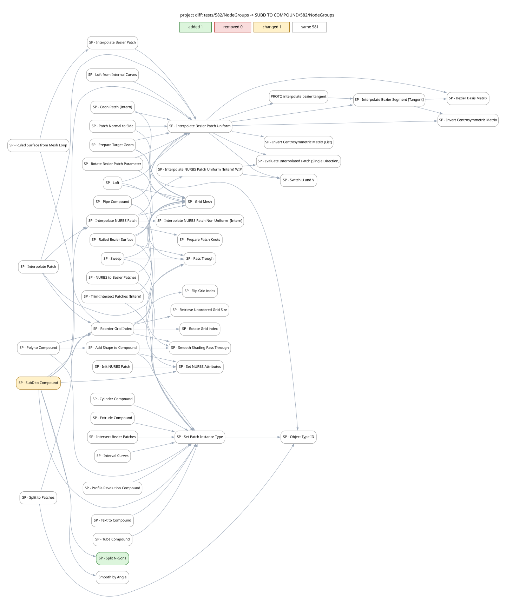
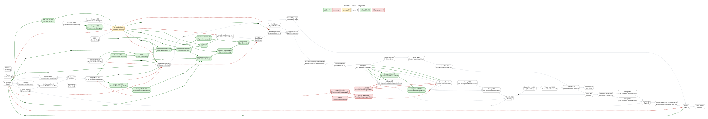
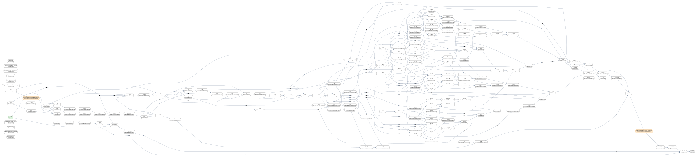
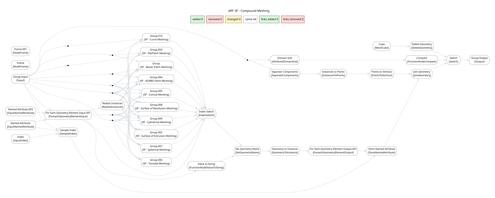

# Case study — reworking `SP - SubD to Compound`

> **A theoretical case run over a real project.** These graphs come from GNToolkit
> applied to a real working file of the
> **[SurfacePsycho](https://github.com/RomainGuimbal/SurfacePsycho)** node library by
> Romain Guimbal, used here as a test bench — with no affiliation or endorsement.
> All credit for the `SP - …` node groups goes to its author.

The change, tracked and diffed with GNToolkit: a working file against the previous
reference export of the same project (582 → 583 tracked groups).

| State | Groups |
|---|---|
| untouched (`same`) | **581** |
| changed | **1** — `SP - SubD to Compound` |
| added | **1** — `SP - Split N-Gons` |
| removed | 0 |

Every graph below is generated from the tracked JSON files only — **no Blender
required**. Cross-project comparison (`gnt_check.py --cross`) finds the forks; the
drawings are rendered with Graphviz from the same JSON. Each graph ships as **SVG**
(vector, embedded below — click to open and zoom) and, for the four detail graphs, a
**PNG** copy next to it (a raster of the full map would be tens of megapixels).

## 1. The whole project

[Open the full dependency graph (583 groups, SVG) →](01-project-diff-full.svg)

*Vector only. Best opened in a browser: zoom around, or Ctrl+F a group name, to find
the two coloured nodes — one changed (amber), one added (green); the other 581 are grey.*

## 2. The neighborhood of the change

Dependency hops ±2 around `SP - SubD to Compound` — 50 groups:

[PNG copy](02-neighborhood.png)

The change sits on the core utilities (`SP - Grid Mesh`, `SP - Reorder Grid Index`,
`SP - Set Patch Instance Type`, …); the moved pieces are only the two coloured nodes.

## 3. Inside the changed group — old vs new

`SP - SubD to Compound` grew from 53 to 86 nodes:

[PNG copy](03-subd-to-compound-diff.png)

- nodes: `+37` added · `−4` removed · `~1` changed · `=48` same
- links: `+64` added · `−18` removed

The picture tells the fix: the old evaluation path (red) was replaced by the N-Gon
splitting machinery (green) built around the new group below.

## 4. The new group — `SP - Split N-Gons`

307 nodes, added by the change:

[PNG copy](04-split-n-gons.png)

## 5. The consumer — `SP - Compound Meshing` did *not* change

Its raw JSON text differs (socket identifiers were renumbered between sessions:
`Input_4→Input_2`, `Generation_0→Generation_1`, `Socket_1→Socket_0`) — but
**semantically it is identical**: the same 44 nodes and the same 96 links once links
are compared by socket *name*:

[PNG copy](05-compound-meshing-unchanged.png)

This is the point of canonical comparison: it reports real changes, not serialization
churn. Comparing raw JSON text (or socket ids) would have flagged this group as
"changed" and buried the two real changes.

## How this was produced

- `python gnt_check.py --cross old/NodeGroups new/NodeGroups` — pure Python, no Blender:
  lists *forks* (same group name, different content) and *shared* logic between the two
  exports, resolving the change set (581/1/1/0).
- A diagnostic Graphviz script renders the same JSONs: the project dependency graph,
  a focused neighborhood, a per-group semantic diff and a single-group graph.
- Diff semantics: canonical node comparison (node positions and connected-socket
  defaults are ignored — cosmetic noise), links identified by socket name (ids are
  session-local).

*Reroutes are drawn as small points; colours: green = added, red = removed,
amber = changed, grey = untouched.*
